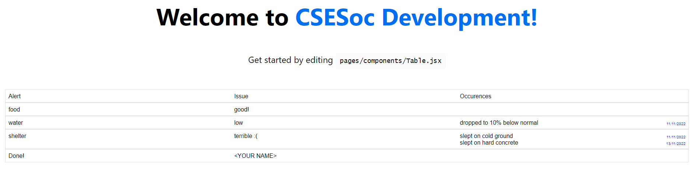

# Who would be interested?
Any frontend-related project would be interested in this eg circles, notangles, websites, UI/UX etc. Do this question if you would like to work on frontend code.

# Question
There is a table rendered in pages/index.tsx and this table is controlled by components/Table.tsx.

This table contains a couple of alerts, and is structured using flexboxes. Have a look at the data it is trying to render:

```
{
          columnTitles: ['Alert', 'Issue', 'Occurences'],
          rowContents: [
            {
              alertType: 'food',
              alertText: 'good!',
              alertOccurence: []
            },
            {
              alertType: 'water',
              alertText: 'low',
              alertOccurence: [{anomaly: 'dropped to 10% below normal', date: '11/11/2022'}]
            },
            {
              alertType: 'shelter',
              alertText: 'terrible :(',
              alertOccurence: [{anomaly: 'slept on cold ground', date: '11/11/2022'}, {anomaly: 'slept on hard concrete', date: '13/11/2022'}]
            }
          ]
        }
```
The interesting problem here is that an alert can occur in multiple occurances. These should be displayed under the same alert. Our coder friend got pretty close to rendering this table using flexboxes, but doesn't know how to handle the multiple occurances dillema. So, they abandoned the project. Unfortunately, he was actually only ~5 lines of code and 10 lines of CSS away from a working solution! Show off to our coder friend by rendering something like the following:

Notice that I can render both of the anomalies in the shelter alert. Also, the date is far off to the side.


Currently, your repo should not render anything under occurances. Your job is to fill it in like the screen above, and then to add your github name in the "YOUR NAME" field. You should then take a screenshot, add it as "submission.png" then commit your code.


IMPORTANT: You must use CSS, and you must use flexboxes. Come up with a minimally invasive solution here, since you also want to teach our coder friend what to do, not do it for him.

# NextJS
This is a [Next.js](https://nextjs.org/) project bootstrapped with [`create-next-app`](https://github.com/vercel/next.js/tree/canary/packages/create-next-app).

## Getting Started
First, run `npm install` to fetch dependencies.

then, run the development server:

```bash
npm run dev
# or
yarn dev
```

Open [http://localhost:3000](http://localhost:3000) with your browser to see the result.

You can start editing the page by modifying `pages/index.js`. The page auto-updates as you edit the file.
