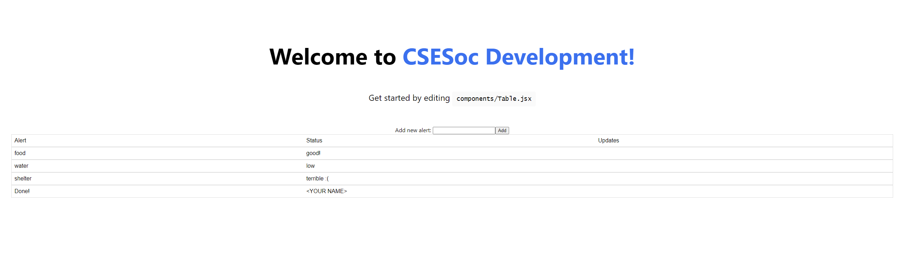
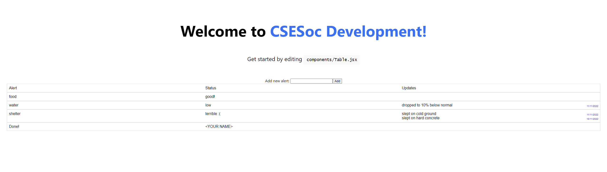

> This question is relevant for **any project with a frontend** (Chaos, Circles,
> CSElectives, Freerooms, Jobsboard, Notangles, Structs.sh, Website).

# Development FE Question - Alert System

> **YOU DO NOT NEED TO COMPLETE ALL PARTS.** Complete the parts that you think best
> reflect your skills.

The year is 2077. The world is in disrepair, nuclear war has ravaged the planet,
climate change has made the average temperature 50 degrees, all the natural resources
have depleted. Somehow, someway, CSESoc has survived, and Development has holed itself
up in a nuclear bunker.

Supplies are limited, and so as budding computer scientists, software engineers and
bioinformaticists, Development has decided to release a new project - an **alert system**.

The project director for this alert system has almost got the frontend figured out,
but he tragically suffered from a lack of Vitamin C++ and perished. Do you have what
it takes to finish the alert system?

## Part 1

> Skills: CSS

The alert system is used by CSESoc Dev to see the status of each of the bunker's vitals.
The system displays **alerts** for vital resources such as food, water and shelter, and
each alert has a **status** (a string) and any number of **updates** (a string and the
date the update was filed).

The data is represented as a JavaScript object, and it looks something like this (you
can see a copy of the object below in `components/Table.tsx`):

```
{
  columnTitles: ['Alert', 'Status', 'Updates'],
  rowContents: [
    {
      alert: 'food',
      status: 'good!',
      updates: []
    },
    {
      alert: 'water',
      status: 'low',
      updates: [{update: 'dropped to 10% below normal', date: '11/11/2022'}]
    },
    {
      alert: 'shelter',
      status: 'terrible :(',
      updates: [{update: 'slept on cold ground', date: '11/11/2022'}, {update: 'slept on hard concrete', date: '13/11/2022'}]
    }
  ]
}
```

The last projects director left one final task - the updates aren't displaying
properly in the table when the webapp is launched:



Your task for this part is to **display the updates for each alert using CSS**,
such that updates appear for each alert, similar to the image below:



Some traits to note about the solution:
- There are multiple updates in each row.
- To the right of each update is the date that update was entered (the `date` field),
  in a smaller font and a different colour.

### Requirements

You must:
- Add updates to the table (`components/Table.tsx`), styled using CSS and flexboxes,
  satisfying the traits listed above. You will need to edit both the `Table.module.css`
  file and the `Table.tsx` file. (If you do not know how to use CSS modules, read
  further for the section titled "CSS Modules").
- Add updates in a **minimally invasive** way - you should not be making any major
  changes to the types, the CSS file, or `index.tsx` for the base task.
- Fill in the field containing `<YOUR NAME>` to your GitHub username.

Once you have completed this, take a screenshot of your table and put it in `images/submission.png`
(other image formats are also allowed).

## EXTENSION: Part 2

> Skills: JavaScript, React

The previous project director was also partially done with making a way to **add
new events**, through an input above the table. However, he couldn't get the
functionality done in time, and as of now the "Add" button only logs the name of
the alert to the console.

Your task is to **implement the "Add" button** in `components/AlertModal/AlertModal.tsx` such
that new events are updated and displayed. There should be a suite of tests available
for you to test whether the button works as expected.

### Requirements

- Implement functionality in `components/AlertModal/AlertModal.tsx` such that new alerts can
  be added.
- Make sure that all tests pass. You can check if tests pass by running `npm run test`.

## Getting set up

You will need to install node/npm. This is best done by using the [`nvm`](https://github.com/nvm-sh/nvm) tool.

1. Install `nvm` according to the instructions in the link above.
2. Use the command `nvm install --lts` to install the latest stable versions of npm/node.
3. Run `node -v` to check that Node has been installed. The response should be
   something like `16.x.x` or `18.x.x`.

Once that's completed:

4. Run `npm install` to fetch dependencies.
5. Run the development server:
    ```bash
    npm run dev
    ```

Open [http://localhost:3000](http://localhost:3000) with your browser to see the result.

You can start editing the page by modifying `pages/index.tsx`. The page auto-updates
when you save the contents of any file.

### CSS Modules

This question uses something called **CSS modules** for `Table.module.css`. When you
need to add new styles to the table, you will need to edit `Table.module.css` like so:

1.  Add your style normally. For example, if we want to add a CSS class `foo`:

    ```css
    .foo {
        /* insert styles here */
    }
    ```

2.  Import the CSS module in your JavaScript/TypeScript file. This is already done
    in the very first line of `Table.tsx`:

    ```ts
    import styles from './Table.module.css';
    ```

3.  Your custom styles can now be accessed as properties of `style` - so when you
    need to access `.foo`, you can use `styles.foo` or `styles['foo']`:

    ```tsx
    <div className={styles.foo}>
    ```

> **NOTE**: if `styles.<your style name>` doesn't work, chances are you named your
> style in such a way that it triggered a syntax error in JS/TS - to be extra safe,
> you can use `styles['<your style name>']` to access that particular CSS class/ID.
